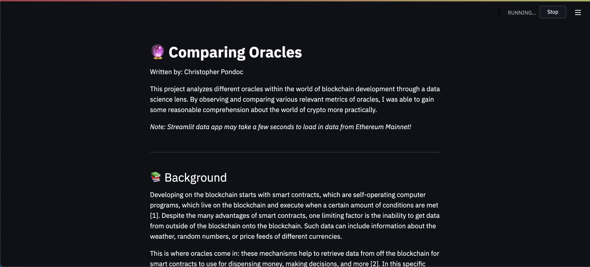

# 🔮 Comparing Different Oracles
Looking at differences between oracles. Simply put, the functions look at the differences in prices across a couple of different cryptocurriences, looking at them on the mainnet in real-time.

Maintained by: Chris Pondoc

## Reference
To check out the written version of this report, click [here](https://github.com/cpondoc/oracle-diff/blob/master/oracle-report.pdf).

To check out the accompanying video report during Tellor's community call, click [here](https://www.youtube.com/watch?v=QMVl0bInf6o&t=33s).

## Structure
* `helpers` helped me to organize connecting to each contract using `web3.py`, utilizing each application binary interface (ABI), and grabbing the correct values.
* `app.py` is the streamlit app that puts all of the data together.
* `feeds` help me organize IDs for different data feeds (or addresses, depending on the protocol). Contracts contain individual ABIs for each contract.

## Run
1. Git clone the repository by running: `git clone https://github.com/tellor-io/oracle-diffs.git`
2. Create a Python virtual environment, so dependencies don’t overlap with one another: `python3 -m venv oracle-diff`.
3. To start the virtual environment, run `source oracle-diff/bin/activate`
4. From there, enter the directory by running `cd oracle-diff`.
5. Once you’re in the `oracle-diff` folder and have everything set-up, install all the needed dependencies. This can be done by running `pip install -r requirements.txt`.
6. Finally, to get the app up and running, simply run `streamlit run streamlit_app.py`.

## Analysis
This report analyzes the following oracles:
* Tellor
* Chainlink
* Band Protocol
* DIA

The report also looked at the following conversions:
* BTC/USD
* ETH/USD
* AMPL/USD

## Notes
Note that Band Protocol Network does not support AMPL, despite being listed as one of the available price data feeds.